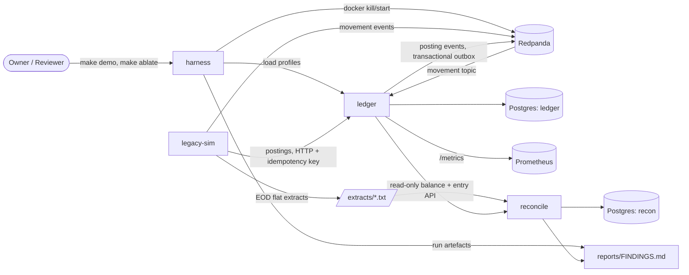

# High-Level Design — SHADOWBOOK

Status: draft
Requirements: `docs/design/01-requirements.md` · Decisions: `docs/design/decisions.md`

## 1. Overview

SHADOWBOOK runs a new double-entry ledger as a read-only shadow of a simulated legacy core and measures two things that matter in a real core migration: how long undocumented incumbent behaviour takes to surface through continuous reconciliation, and what message-delivery design costs you when the broker fails mid-flight.

Four processes, one direction of travel. `legacy-sim` generates a deterministic transaction stream and end-of-day extracts, applying twelve seeded quirks. The same stream is fed to `ledger`, which posts it under documented rules. `reconcile` compares the two at three grains every simulated business day and classifies every break. `harness` drives load, kills brokers, and renders findings. Nothing shares a database; every component owns its own store and talks over explicit contracts.

The architecture exists to make two claims falsifiable. Determinism is therefore a first-class design constraint, not a testing convenience: same seed in, byte-identical extracts and identical findings tables out (FR-S6, NFR-5).

## 2. Architecture style

**Event-driven pipeline of four single-purpose processes, each an internally modular monolith.**

Rationale, tied to NFRs:

- The findings *are* the pipeline. Finding 2 measures what happens between a producer and a consumer under broker loss (FR-H3), so the broker hop must be real and the consumer must be a separate process with its own offset state. This is the one place where a distributed design is required by the requirements rather than chosen for taste.
- Everything else stays a monolith. One ledger binary holds the API, the outbox relay, the consumer and the accrual job as internal modules behind interfaces. NFR-1 (≥ 2,000 postings/s) is a single-instance target — there is no scaling requirement that would justify splitting them, and each split would cost `make check` time (NFR-6, < 3 min) and context size.
- Two languages, not three (D-001, D-005). Go on the hot path and the I/O edge; Python for generation, comparison and rendering. `make check` configures exactly two toolchains.
- No orchestration layer. Docker Compose profiles only; Kubernetes is explicitly out of scope (§5 of requirements).

## 3. System context



No external systems. No auth provider, no payment rail, no third party — a static principal header is the entire authorization model (requirements §7). This is a closed, reproducible harness by design.

## 4. Components

| Component | Responsibility | Talks to | Owns data? |
|---|---|---|---|
| `ledger` (Go) | Posting API with idempotency (FR-L1–L3); derived balances and holds (FR-L4, L5); EOD accrual (FR-L6); transactional outbox (FR-L7); movement consumer with four delivery modes (FR-L8); metrics (FR-L9) | Postgres (ledger), Redpanda, Prometheus | **Yes** — sole writer of `entries`, `postings`, `holds`, `checkpoints`, `idempotency_keys`, `inbox`, `outbox` |
| `legacy-sim` (Python) | Deterministic stream and EOD extracts from a seed (FR-S1, S3, S6); applies the twelve quirks (FR-S2); owns the business calendar (FR-S5) | ledger HTTP API, Redpanda, filesystem | **Yes** — its own generated state; writes extracts as files, never to a ledger table |
| `reconcile` (Python) | Three-grain comparison (FR-R1); deterministic break classification and ageing (FR-R2); time-to-discovery report (FR-R3); tolerant extract ingest (FR-R4) | extract files, ledger read API, Postgres (recon) | **Yes** — sole writer of `breaks`, `break_history`, `extract_ingests` |
| `harness` (Go + Python) | Open-model load with named profiles (FR-H1); scripted broker chaos (FR-H2); A–D ablation runner (FR-H3); report rendering (FR-H4, H5) | ledger, Docker, Prometheus, run artefacts | **No** — writes run artefacts to `reports/runs/` only |

Responsibilities deliberately do not overlap. `reconcile` never writes to the ledger; `legacy-sim` never reads ledger state (it would contaminate the comparison); `harness` owns no business logic at all.

## 5. Data architecture

### 5.1 Stores

| Store | Why | Owner |
|---|---|---|
| Postgres 16 — `ledger` db | Needs transactional integrity across entries + idempotency + outbox in one commit (FR-L2, FR-L7). Constraints and triggers are where the invariants are enforced, not application code. | `ledger` |
| Postgres 16 — `recon` db | Physically separate so no query can accidentally join across the boundary and hide a break. Different lifecycle: dropped and rebuilt per run. | `reconcile` |
| Redpanda (Kafka API) | The failure surface Finding 2 measures (D-002). | shared transport |
| Filesystem — `extracts/`, `reports/runs/` | Flat extracts must look like real EOD files — header, detail, trailer with record count and control total (FR-S3) — for the reconciler to have a realistic ingest problem. Run artefacts are the input to `make report`. | `legacy-sim`, `harness` |

Two Postgres instances rather than two schemas in one: it makes the single-writer rule physically enforced and matches the compose topology the chaos runs already need.

### 5.2 Ledger data model shape

Balances are never stored. `entries` is append-only and immutable (FR-L3), enforced by a rule that raises on UPDATE and DELETE; reversals insert contra entries carrying `reverses_entry_id`, never deletions — which is exactly what Q9 (`reversal_deletes_original`) seeds on the legacy side. `checkpoints` are inserts. A balance read is `checkpoint + SUM(entries since)`. The global invariant `SUM(amount_minor) GROUP BY currency = 0` is a query, evaluated on a ticker and exposed as `shadowbook_ledger_invariant_ok` (FR-L9), and asserted after every integration scenario.

### 5.3 Money

Integer minor units, ISO currency, explicit scale, in every layer including the wire contract (FR-L11). JPY is scale 0 — Q10 seeds the legacy core storing it at scale 2 and truncating, so the shadow must be structurally incapable of the same mistake. No float anywhere; no float in Python either (the reconciler compares integers).

### 5.4 Day count, rounding and cut-off — stated once

These three rules are the shadow's documented behaviour. They live in exactly one module per language and are the only place these constants appear.

| Rule | Shadow (documented) | Quirk that diverges | Requirement |
|---|---|---|---|
| Interest rounding | half-even to minor units | Q1 (legacy: half-up) | FR-L6 |
| Day-count basis, normal year | ACT/365, **all products** | Q3 (legacy: ACT/360 on SAV-01) | FR-L6 |
| Day-count basis, leap year | ACT/ACT (366 denominator) | Q6 (legacy: ACT/365, so day 366 over-accrues) | FR-L6 |
| Interest posting date | calendar first of month | Q12 (legacy: first *business* day) | FR-L6 |
| Cut-off | 17:00:00.000 **exclusive** | Q2 (legacy: 16:59:59.999 rolls to next day) | FR-L12 |
| Hold expiry | 72 hours after placement | Q8 (legacy: midnight on placement + 3) | FR-L5 |
| Minimum-balance fee basis | available balance | Q7 (legacy: ledger balance) | FR-L4 |

`legacy-sim/quirks.yaml` carries a `documented:` field per quirk and remains the source of truth; this table is the shadow-side mirror of those fields and must be diffed against them by a test, so the two cannot drift.

### 5.5 The business calendar — and a defect in the demo window

Quirk cadences are calendar-gated: Q5 fires only on Columbus Day (October), Q6 only on a leap day (February), Q4/Q7 at month end, Q12 only when the first of a month is **not** a business day.

A 30-business-day window is about six calendar weeks. **It cannot contain both an October holiday and a February leap day** — they are roughly four and a half months apart. Left alone, Finding 1 would report Q5 and Q6 as undetected for calendar reasons that have nothing to do with the quality of the reconciliation, which is precisely the false negative the whole exercise is meant to avoid.

Worse, the naive fix is also wrong: anchoring the window to include Feb 29 2028 lands the month boundary on Wednesday 1 March 2028, where the calendar first *is* the first business day — so Q12 silently cannot fire either.

**Recommended window design.** `make demo` runs two windows, and the Finding 1 table gains a `window` column:

| Window | Span | Business days | Quirks it can trigger |
|---|---|---|---|
| W1 `leap-and-month-end` | 2028-02-28 → 2028-04-07 | 30 | Q1, Q2, Q3, Q4, Q6, Q7, Q8, Q9, Q10, Q11, Q12 |
| W2 `columbus` | 2028-10-02 → 2028-10-13 | 9 | Q5 (Columbus Day is Monday 2028-10-09) |

W1 is anchored at 2028-02-28 deliberately, and every claim here is computed rather than asserted: 2028-02-28 → 2028-04-07 is **exactly** 30 business days; it contains Feb 29 2028 (Q6); it contains two month ends, Feb 29 and Mar 31 (Q4, Q7); 1 April 2028 falls on a **Saturday**, so Q12 diverges; and the nearest US federal holiday, Presidents Day 2028-02-21, sits just outside the window, so no holiday perturbs the count. W2 spans 9 business days, not 10 — Columbus Day is a holiday under the documented calendar and is therefore excluded from its own window, which is the point. Total simulated time stays well inside NFR-4's five-minute budget (FR-H5). Every quirk becomes reachable by at least one window, which is the property Finding 1 depends on.

This is open question 1 at the gate.

### 5.6 How legacy-sim reaches the ledger (FR-S4)

FR-S4 leaves this open: API or topic. **Both, deliberately, because the two findings need different things.**

| Path | Used by | Why |
|---|---|---|
| HTTP `POST /postings` with an idempotency key | `make demo`, Finding 1 | Exercises FR-L1's idempotency-by-constraint on the path a real migration would use for replay, and is `curl`-reproducible for a reviewer |
| Movement topic → consumer | `make ablate`, Finding 2 | Finding 2 is *about* the consumer; postings must arrive over the broker for loss and duplication to mean anything |

Both land in the same posting service behind one interface, so neither path can develop its own semantics. A contract test asserts that the same input produces identical entries, balances and outbox rows through either path — this is risk R6 and it is a gate, not a hope.

## 6. Critical flows

### 6.1 Posting with idempotency and outbox (FR-L1, L2, L7)

```mermaid
sequenceDiagram
    participant S as legacy-sim
    participant A as ledger API
    participant DB as Postgres (ledger)
    participant R as outbox relay
    participant K as Redpanda

    S->>A: POST /postings (Idempotency-Key, body)
    A->>DB: BEGIN
    A->>DB: INSERT idempotency_keys (principal, key, body_hash) -- UNIQUE
    alt unique violation, same body_hash
        DB-->>A: 23505
        A->>DB: ROLLBACK; SELECT stored response
        A-->>S: 200 + identical stored response
    else unique violation, different body_hash
        DB-->>A: 23505
        A-->>S: 409 IdempotencyBodyMismatch
    else no violation
        A->>DB: INSERT posting + >=2 entries (deferred zero-sum constraint)
        A->>DB: INSERT outbox row (same transaction)
        A->>DB: COMMIT
        A-->>S: 201 + posting id
    end
    R->>DB: poll outbox, claim batch
    R->>K: produce (key = account_id, acks=all)
    R->>DB: mark outbox rows sent
```

The duplicate is detected by the constraint violation, never by a prior SELECT — that is what makes the idempotency-race scenario (N concurrent same-key requests → exactly one effect) pass deterministically rather than by luck.

### 6.2 Movement consumption under four delivery modes (FR-L8)

```mermaid
sequenceDiagram
    participant K as Redpanda
    participant C as consumer
    participant DB as Postgres (ledger)

    K->>C: fetch batch
    alt A: at-most-once
        C->>K: commit offsets FIRST
        C->>DB: apply postings
        Note over C,DB: broker kill between the two loses the batch
    else B: naive at-least-once
        C->>DB: apply postings
        C->>K: commit offsets after
        Note over C,DB: redelivery re-applies -- duplicates
    else C: at-least-once + inbox
        C->>DB: BEGIN; INSERT inbox(message_id) UNIQUE; apply; COMMIT
        Note over C,DB: redelivery hits the constraint -- exactly-once effect
        C->>K: commit offsets after
    else D: transactional (M6b)
        C->>DB: apply within DB txn
        C->>K: GroupTransactSession: produce + commit offsets atomically
        Note over C,K: guarantee ends at the database boundary
    end
```

Configuration D uses `kgo.GroupTransactSession` (franz-go `pkg/kgo/txn.go`), verified to exist in v1.21.6. Its behaviour against Redpanda specifically is the M0 go/no-go of D-002.

### 6.3 End-of-day close and reconciliation (FR-R1–R4)

```mermaid
sequenceDiagram
    participant SIM as legacy-sim
    participant L as ledger
    participant RC as reconcile
    participant RDB as Postgres (recon)

    SIM->>SIM: advance business date, apply quirk cadences
    SIM->>SIM: write extract (header, detail, trailer + control total)
    L->>L: EOD job: accrual, hold expiry, checkpoint
    RC->>SIM: ingest extract
    RC->>RC: validate trailer: record count + control total
    alt trailer mismatch or truncated
        RC->>RDB: record partial ingest; do NOT double count; raise ingest break
    else valid
        RC->>L: read entries + balances for the business date
        RC->>RC: grain 1 transaction, grain 2 account-day, grain 3 control total
        RC->>RC: classify timing | model-difference | defect
        RC->>RDB: upsert breaks, age open breaks, close resolved
    end
    RC->>RC: per quirk -- first detection day, grain, breaks at detection, breaks to isolate
```

Late, redelivered and truncated extracts are handled at ingest, before comparison, keyed on `(extract_type, business_date, sequence)` so a redelivery is idempotent (FR-R4).

### 6.4 Ablation run (FR-H3)

```mermaid
sequenceDiagram
    participant H as harness
    participant L as ledger
    participant D as Docker
    participant P as Prometheus

    H->>H: fix seed, profile, duration, schedule, versions
    loop config A, B, C (D at M6b)
        H->>L: restart with delivery mode
        H->>L: t+0 start load (vegeta: Pacer + seeded Targeter)
        H->>D: t+60 kill broker-1 / t+90 start
        H->>D: t+150 kill broker-2 / t+180 start
        H->>L: t+240 stop load; drain until lag 0 or 120 s
        H->>P: scrape sent, applied, lost, duplicated, p50/p95/p99, lag peak
        H->>H: assert global invariant; write run artefact
    end
    H->>H: refuse to render if fixed parameters differ across artefacts
```

## 7. Technology stack recommendation

Settled at Phase 0 and not re-argued here: Go + Python (D-001), Redpanda (D-002), franz-go (D-006), vegeta (D-005). Versions below were verified against the registries on 2026-09-03.

### 7.1 Posting API transport (FR-L1)

| Option | Strengths | Costs / risks |
|---|---|---|
| HTTP/JSON, `net/http` + stdlib `ServeMux` | Zero framework dependency; Go 1.22+ mux does method+path patterns; `curl`-able in the runbook; vegeta is an HTTP load generator | Hand-rolled decoding and validation; no schema enforcement on the edge |
| gRPC | Protobuf contracts already exist for events; generated clients; typed errors | vegeta cannot drive it, which contradicts D-005; a second contract style for the reviewer to read |
| HTTP/JSON + `chi` router | Middleware chain for the principal header, request ID, metrics | One more dependency for routing a handful of routes |

**Recommendation: HTTP/JSON on `net/http` with the stdlib mux.** vegeta drives HTTP, so gRPC would immediately undo D-005. The API surface is roughly four routes (`POST /postings`, `POST /holds`, `GET /accounts/{id}/balances`, `GET /accounts/{id}/entries`) — not enough to justify a router, let alone a framework. Protobuf stays where it earns its keep: the event contracts on the topic. Reviewers can reproduce a posting with `curl`, which matters for a portfolio repo.

### 7.2 Postgres driver

| Option | Strengths | Costs / risks |
|---|---|---|
| `jackc/pgx` v5 (v5.10.0) | Native protocol, real prepared-statement caching, `pgxpool`, first-class `numeric`/`int8` handling, direct access to `SQLSTATE` for the 23505 idempotency path | Not `database/sql` unless you opt in; its own idioms |
| `database/sql` + `lib/pq` | Stdlib interface, maximal familiarity | `lib/pq` is in maintenance; slower; error inspection is string-ish |

**Recommendation: pgx v5.** Flow 6.1 depends on distinguishing a unique-constraint violation by SQLSTATE `23505` and constraint name — pgx exposes that as a typed `*pgconn.PgError`, which is exactly the "idempotency by constraint, not by application logic" invariant. Its pooling is also what makes NFR-1's 2,000 postings/s plausible on one box.

### 7.3 Schema migrations

| Option | Strengths | Costs / risks |
|---|---|---|
| `pressly/goose` v3 (v3.28.0) | Plain SQL migrations, embeddable via `embed.FS`, Go-native, supports `--no-versioning` for test fixtures | Go migrations need registration boilerplate |
| `golang-migrate` | Very widely used; many drivers | CLI-first ergonomics; dirty-state handling is a known sharp edge |
| Hand-rolled `.sql` + a bootstrap script | No dependency at all | Reinvents ordering, versioning and idempotence — exactly what you do not want under append-only invariants |

**Recommendation: goose, plain-SQL migrations, embedded.** The ledger's invariants live in DDL — the append-only rule, the deferred zero-sum constraint, the unique indexes on `idempotency_keys` and `inbox`. Those belong in reviewable SQL files, not in an ORM's imagination. Embedding via `embed.FS` keeps `make check` offline (NFR-8).

### 7.4 Protobuf tooling

| Option | Strengths | Costs / risks |
|---|---|---|
| `buf` | Lint and breaking-change detection in CI, reproducible codegen from `buf.gen.yaml`, no local protoc install | One more binary in SETUP.md |
| `protoc` + plugins | Ubiquitous | Version drift between machines; no breaking-change gate |

**Recommendation: buf.** `buf breaking` is the mechanism that stops the frozen event contract from drifting between the Go and Python sides (D-001's stated consequence). Generated code is checked in and CI diffs it, so codegen never has to run offline in `make check`.

### 7.5 Metrics

**Recommendation: `prometheus/client_golang`, scraped by the Prometheus already in `docker-compose.yml`.** FR-L9 names Prometheus explicitly. The invariant gauge `shadowbook_ledger_invariant_ok` is the unusual one: it is a metric *and* a test assertion, so the check function is exported and called directly from integration tests rather than scraped in them.

### 7.6 Python toolchain

**Recommendation: uv, ruff, mypy `--strict`, pytest** — already fixed by CLAUDE.md. For `reconcile`, **standard library only for data handling: `csv`, `dataclasses`, `decimal` (never `float`), explicit sort keys.** No pandas or polars. Thirty business days across a few thousand accounts is small data; a dataframe library would buy speed we do not need and cost the one thing we cannot lose — deterministic row ordering (NFR-5, FR-S6). Explicit sorts that mypy can check are the safer trade. **Jinja2** for report rendering, because `FINDINGS.md` is a fixed template with tables (`findings-report` skill) and template-vs-data separation is what keeps it generated rather than hand-edited.

### 7.7 Load generation — extension points confirmed

**vegeta v12 (v12.13.0)**, per D-005. Verified against the source: `Attacker.Attack(tr Targeter, p Pacer, du time.Duration, name string) <-chan *Result`, where `Targeter` is `func(*Target) error` (`lib/targets.go:114`) and `Pacer` is an interface with `Pace(elapsed time.Duration, hits uint64) (time.Duration, bool)` (`lib/pacer.go`). Both profile *shape* and per-request *content* are therefore small, seedable interfaces we implement and unit-test inside `make check`:

| Profile (FR-H1) | Pacer | Targeter |
|---|---|---|
| steady | `ConstantPacer` | uniform account selection from seeded RNG |
| payday spike | `SinePacer` or a custom step pacer | uniform |
| month-end | custom pacer, ramp into close | biased to fee-eligible accounts |
| hot-key | `ConstantPacer` | two accounts ≥ 20% of traffic, seeded |

This is the concrete answer to D-005's "more work up front": it is two small interfaces, both deterministic given a seed.

### 7.8 Summary

| Layer | Recommendation | Version verified |
|---|---|---|
| Ledger language | Go | 1.23+ |
| Posting API | `net/http` + stdlib mux, HTTP/JSON | stdlib |
| Postgres driver | `jackc/pgx` v5 | v5.10.0 |
| Migrations | `pressly/goose` v3, plain SQL, embedded | v3.28.0 |
| Kafka client | `twmb/franz-go` (D-006) | v1.21.6 |
| Broker | Redpanda (D-002) | pin at M0 |
| Protobuf | `buf`, generated code checked in | latest |
| Metrics | `prometheus/client_golang` | latest |
| Sim / recon / report | Python 3.12+, uv, ruff, mypy --strict, pytest, stdlib data handling, Jinja2 | — |
| Load generator | `tsenart/vegeta` v12 (D-005) | v12.13.0 |

Confirm or override each recommendation at this gate — overrides are fine and will be recorded in `decisions.md`.

## 8. Cross-cutting concerns

### 8.1 Authorization
A static `X-Principal` header, validated against a configured allow-list. Idempotency keys are scoped per principal (FR-L1), so the principal is load-bearing for correctness even though it is not load-bearing for security. Anything more is out of scope (requirements §7).

### 8.2 Configuration and secrets
Environment variables only, `.env` gitignored, `.env.example` checked in. No secret ever reaches a log line or a metric label. The pre-public sweep in SETUP.md §7 is the gate.

### 8.3 Determinism — the design constraint that touches everything
Three sources of non-determinism are designed out rather than tested for:

1. **Clock.** No component calls `time.Now()` or `datetime.now()` outside one injected clock per process. Business date, value date and cut-off are parameters (FR-L12); the simulated business date advances only when the EOD job says so.
2. **Randomness.** One seeded RNG per component, derived from `SHADOWBOOK_SEED` by a documented split so `legacy-sim` and the harness never share a stream.
3. **Ordering.** Every collection that reaches an output is sorted by an explicit key. No reliance on map iteration order, filesystem order, or database order without `ORDER BY`.

Finding 2 is a measurement of a chaotic system and is *not* claimed to be deterministic; NFR-5 applies to `legacy-sim` and `reconcile`, and Finding 2 is reproduced statistically (median of ≥ 3 runs with min–max, per the `findings-report` skill).

### 8.4 Logging and error handling
Go: `log/slog`, JSON to stdout, one request-scoped logger carrying request ID, principal and business date. Python: `logging`, JSON formatter, same field names so the two are greppable together.

Fail fast on anything that could violate an invariant — a zero-sum failure, an append-only violation, a checkpoint mismatch — because a shadow ledger that degrades gracefully into a wrong number is worse than one that stops. Degrade only at the ingest edge, where FR-R4 requires surviving late, redelivered and truncated extracts: those raise a recorded break, never an exception that kills the run.

### 8.5 Background work
Three loops in the ledger, each with a cancellation path and no goroutine started without one (CLAUDE.md): the outbox relay, the invariant checker on a ticker, and the EOD job triggered by the harness rather than by wall-clock time. Graceful shutdown drains in-flight work, commits offsets and closes (FR-L10).

### 8.6 Caching
None. Balances are derived per read with checkpoints (FR-L4); a cache would be a second source of truth and the first thing a reviewer would distrust. Checkpoint frequency is the tuning knob if NFR-2's p99 ≤ 50 ms is missed.

## 9. Non-functional design

| ID | Target | How the architecture meets it |
|---|---|---|
| NFR-1 | ≥ 2,000 postings/s steady | Single ledger process, pgxpool, prepared statements, batched outbox relay; one round trip per posting |
| NFR-1a | ≥ 1,000/s during chaos, identical across configs | Rate fixed by the harness and asserted equal across run artefacts (D-007) |
| NFR-2 | p99 ≤ 50 ms | One transaction per posting; checkpoint interval tuned so balance reads stay bounded |
| NFR-3 | invariant lag ≤ 1 s | Ticker-driven check over an indexed aggregate, exposed as a gauge with a last-check timestamp |
| NFR-4 | demo ≤ 5 min | Two windows, 40 business days total (§5.5); simulated time advances on command, never in real time |
| NFR-5 | determinism | §8.3; golden-file test over extracts and the Finding 1 table |
| NFR-6 | `make check` < 3 min | Two toolchains; testcontainers reused across integration tests; no codegen at check time (§7.4) |
| NFR-7 | coverage: ledger ≥ 85% / posting path ≥ 95%, reconcile classification ≥ 90% | Enforced in `make check`. **Proposed addition: `legacy-sim` ≥ 85%** — FR-S6 byte-identical determinism depends on it and it currently has no target. Open question 2 |
| NFR-8 | offline `make check` | Generated protobuf code checked in; migrations embedded; images pinned by digest |
| NFR-9 | producer durability fixed | `acks=all`, RF=3, `min.insync.replicas=2`, unclean leader election off — in compose config and asserted by a test, not just documented |

## 10. Risks and mitigations

| # | Risk | Mitigation |
|---|---|---|
| R1 | **Calendar windows make Q5/Q6/Q12 unreachable**, so Finding 1 shows false negatives that look like reconciliation failures | §5.5 two-window design; a test asserts every quirk is reachable by at least one configured window before a run is allowed to render |
| R2 | Redpanda's transaction semantics differ from Apache Kafka, breaking configuration D | D-002 go/no-go at M0; D is already off the weekend-2 critical path (D-008), so this cannot sink Finding 2 |
| R3 | Box cannot sustain three brokers + two Postgres + load | D-007 relaxed target; if still short, reduce account count before reducing rate, since rate equality across configs is what the finding depends on |
| R4 | Quirks all detected on day 1, making Finding 1 trivial | Q4, Q5, Q6, Q12 are calendar-gated by design; validate the cadence spread at M2 and report undetected quirks rather than hiding them |
| R5 | Time — delivery dates are fixed | M0–M4 in weekend 1; `git tag round-2` at whatever state exists; A/B/C alone is a complete Finding 2 |
| R6 | Two ingress paths (HTTP for the demo, topic for the ablation) diverge in behaviour | Both land in the same posting service behind one interface; a contract test asserts identical effects for the same input via both paths |
| R7 | The shadow's documented rules drift from `quirks.yaml`'s `documented:` fields | §5.4 mirror table is diffed against `quirks.yaml` by a test in `make check` |

## 11. Explicitly out of scope

Real money or real data; customer master, product catalogue, channels, cards, lending; authorization beyond the static principal header; Kubernetes; real multi-region (stretch S1 only, after M7); any LLM in a posting, matching or classification path (FR-R5, D-004) — the single permitted use is narrative drafting in the report, flag-off by default and off in `make check`; production claims of any kind.

## 12. Open questions for this gate

1. **Calendar windows (§5.5).** Adopt the two-window design — W1 `2028-02-28 → 2028-04-07` (30 business days) and W2 `2028-10-02 → 2028-10-13` (10 business days)? The alternative is to redefine Q5 to a holiday inside W1, which changes `quirks.yaml` and needs your sign-off as a quirk redefinition.
2. **NFR-7 (§9).** Add a `legacy-sim` coverage target of ≥ 85%?
3. **Dual ingress (§5.6).** Confirm that `legacy-sim` feeds the ledger over **both** the HTTP API (Finding 1) and the movement topic (Finding 2), rather than picking one, with a contract test asserting the two paths are equivalent?
4. **Stack (§7).** Confirm or override: `net/http` + stdlib mux, pgx v5, goose, buf, `prometheus/client_golang`, stdlib data handling in `reconcile`, Jinja2.
